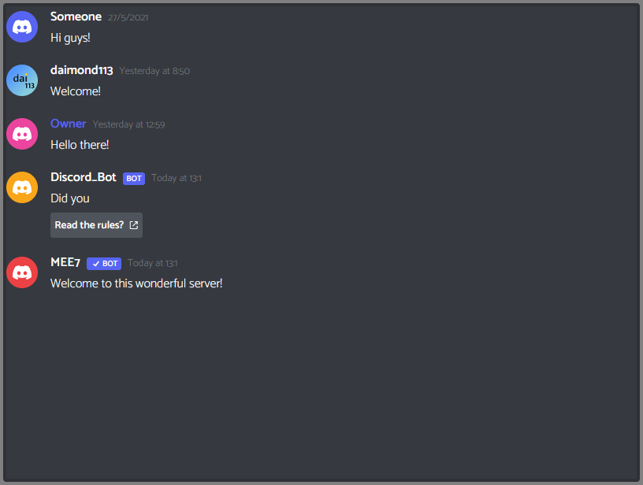

# discord-messages-react
Simulate Discord chats in React



## Using this package is very simple. Here's an example!

```tsx
import { Background, Message, Button } from 'discord-messages-react'

export default function MyChat() {
    return <Background>
				<Message
					avatar="blurple"
					authorName="Someone"
					at={new Date(2021, 5, 27)}
				>
					Hi guys!
				</Message>
				<Message
					avatar="https://avatars.githubusercontent.com/u/72147841?v=4"
					authorName="daimond113"
					at={new Date('June 28, 2021 08:50')}
				>
					Welcome!
				</Message>
				<Message
					at={new Date(Date.now() - (86_400_000 + 100_000))}
					avatar="pink"
					authorName="Owner"
					roleColor="hsl(235, 85.6%, 64.7%)"
				>
					Hello there!
				</Message>
				<Message
					at={new Date(Date.now())}
					avatar="orange"
					authorName="Discord_Bot"
					components={[
						[
							<Button
								disabled={false}
								buttonType="link"
								href="https://example.com"
							>
								Read the rules?
							</Button>,
						],
					]}
					bot={{}}
				>
					Did you
				</Message>
				<Message
					at={new Date(Date.now())}
					avatar="red"
					authorName="MEE7"
					bot={{ verified: true }}
				>
					Welcome to this wonderful server!
				</Message>
			</Background>
}
```

# Problems

## My font isn't the same as the picture!
Don't forget to include this in your HTML: 


```html
  <link rel="preconnect" href="https://fonts.gstatic.com" crossorigin>
  <link href="https://fonts.googleapis.com/css2?family=Catamaran:wght@300;600&display=swap" rel="stylesheet">
```

